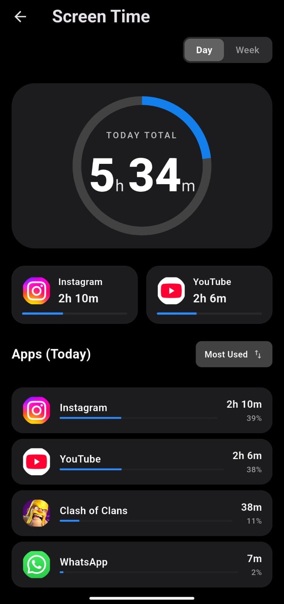
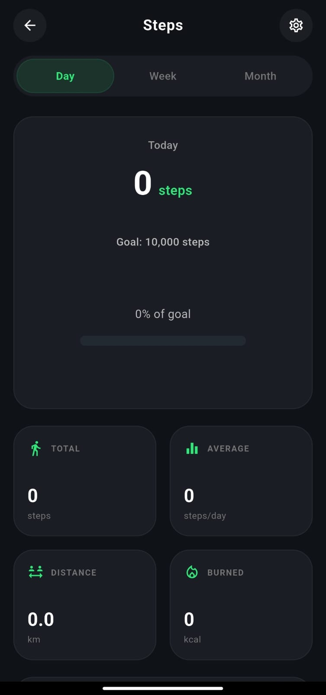
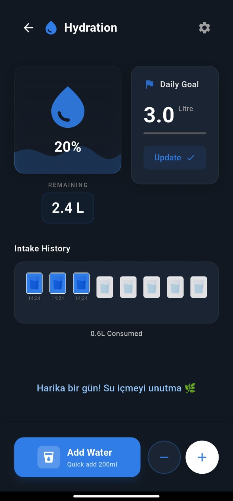

# Healty — Health & Wellness App (Flutter Prototype)

Healty is a Flutter mobile app prototype for daily health habits and usage awareness.  
**Status:** Under active development (not a final product).

## Features
- **Step counter** (daily activity tracking)
- **Water intake reminder**
- **Screen Time dashboard**(real app usage via Android Usage Access; Today/Week breakdown)
- **Posture awareness** (tech-neck angle feedback)
- **Usage limit alerts** (sends notifications when app usage exceeds a threshold)
- **Offline-first** (works without a backend)

## Tech Stack
- Flutter / Dart
- Local storage (offline usage)

## Permissions (Android)
- **Physical Activity / Activity Recognition** for step counting
- **Usage Access (UsageStats)** for real app usage (Screen Time)
- **Notifications** for reminders and usage limit alerts

## Getting Started
```bash
flutter pub get
flutter run
```

## Project Structure
```text
lib/
  screens/        UI screens (dashboard, water, screen time, posture, etc.)
  services/       Background tasks / reminders / integrations
  models/         Data models
  utils/          Helpers & constants
assets/           App assets
```

## Known Limitations
- Sensor-based posture estimation is approximate and may vary by device

## Screenshots





## Notes
Developed with AI-assisted tooling; requirements, iteration, and testing were done by me.
